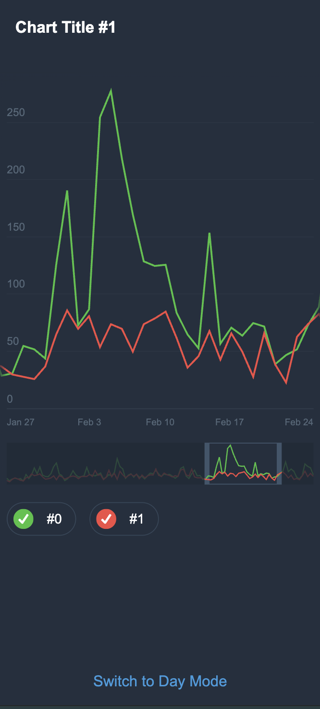
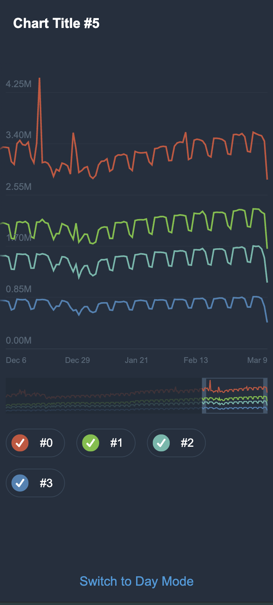

# Telegram Contest Charts

This repository contains my submission for the Telegram JS Contest in 2021. The primary goal of the competition was to build a chart rendering engine that was as lightweight as possible, developed entirely from scratch without using any external frameworks or UI libraries. The resulting implementation is a dependency-free JavaScript and SVG engine designed to render interactive multi-line charts efficiently on both mobile and desktop browsers using pure DOM manipulation.
## Screenshots

|                              Classic Chart                               |                              Big Data Chart                              |
|:------------------------------------------------------------------------:|:------------------------------------------------------------------------:|
|  |  |

## Features

*   **Pure SVG Rendering:** Charts are rendered using native SVG elements (`polyline`, `circle`), ensuring crisp visuals at any screen resolution.
*   **Interactive Viewport Slider:** A custom timeline selector (preview slider) at the bottom allows users to drag, resize, and zoom into specific regions of the data.
*   **Dynamic Y-Axis Scaling:** The vertical scale and horizontal grid lines automatically adjust to fit the minimum and maximum values of the currently visible data range.
*   **Data Series Toggling:** Users can enable or disable individual data lines via the legend buttons at the bottom.
*   **Detailed Tooltips (Data Flags):** Hovering over or touching the chart displays an interactive tooltip with precise values for that timestamp, along with markers indicating the points on the active lines.
*   **Responsive Layout:** Automatically scales and fits different screen sizes, orientations, and aspect ratios.
*   **Theme Support:** Day and Night modes with CSS variable-based transitions.

## Project Structure

*   `src/js/app.js` — Application entry point, handles initialization, theme switching, and window events.
*   `src/js/components/` — UI components including the main `Chart`, the timeline `ChartPreview` (and its `Slider`), and the `ChartLegend`.
*   `src/js/tools/` — Core logical tools including `Line`, `LinesGroup`, `Drawing`, and custom `Events`.
*   `src/js/utils/` — Helper utilities for mathematical calculations, date formatting, array manipulation, and SVG creation.
*   `src/styles/` — PostCSS stylesheets organized by component and theme.

## Tech Stack

*   **Language:** Vanilla JavaScript (ES6+)
*   **Styles:** PostCSS with custom media queries and nesting
*   **Build Tools:** Rollup (for bundling JS), Babel (for compatibility), and PostCSS CLI (for CSS processing)

## Getting Started

### Prerequisites

*   **Node.js:** This project was originally developed around 2021. If you run into compatibility issues with PostCSS source maps on newer Node.js versions (such as Node 20+), consider running the build on an older LTS version (like Node 14 or 16) or disabling source maps in `postcss.config.js`.

### Installation

1. Clone the repository:
   ```bash
   git clone https://github.com/your-username/telegram-contest-charts.git
   cd telegram-contest-charts
   ```

2. Install dependencies:
   ```bash
   npm install
   ```

### Development

To build the CSS and watch for changes:
```bash
npm run start:css
```

To run the Rollup development server with live reload:
```bash
npm run dev
```

### Production Build

To bundle and minify the assets for production deployment:
```bash
npm run build
```

The compiled output will be generated in the `dist/` directory.

